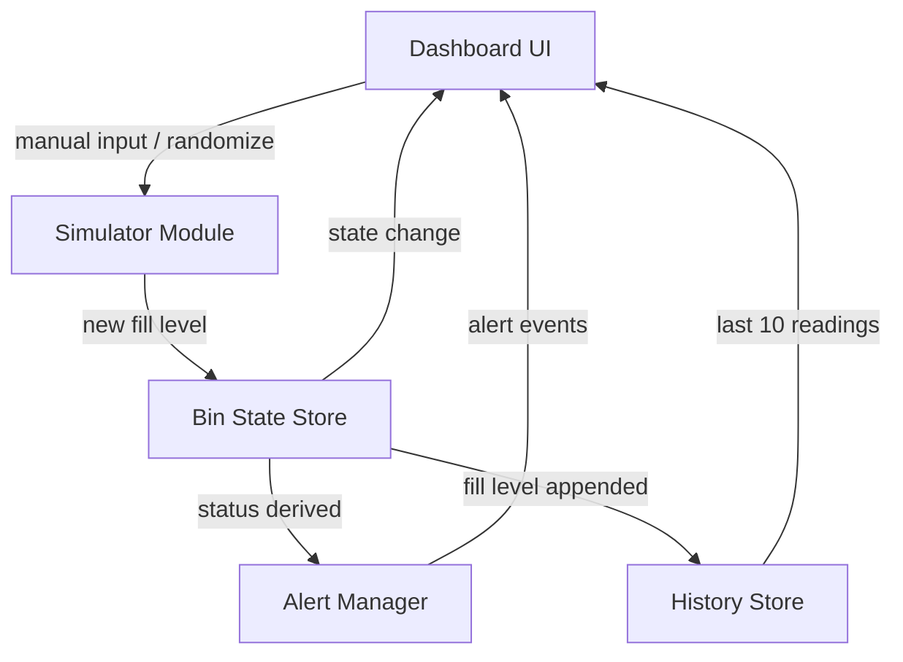

# Design Document: IoT Waste Management

## Overview

This is a browser-only simulation app for smart dustbin monitoring. No backend, no real hardware — everything runs in plain HTML, CSS, and JavaScript. The app simulates fill level sensors for 2–3 bins, derives their status, displays a live dashboard, and alerts operators when bins are full.

The architecture is intentionally simple: a single HTML page with vanilla JS modules. No build tools, no frameworks. The goal is beginner-friendliness and zero-dependency deployment.

## Architecture



All state lives in memory (JS objects). There is no persistence between page reloads. The flow is:

1. User triggers an update (manual input or randomize button)
2. Simulator validates and produces a new fill level
3. Bin state is updated (fill level, status, timestamp)
4. History is appended
5. UI re-renders the affected bin card (progress bar, label, timestamp, chart)
6. Alert manager checks status and shows/hides alert banner

## Components and Interfaces

### Simulator Module (`simulator.js`)

Responsible for generating and validating fill level values.

```js
// Generate a random fill level integer in [0, 100]
function randomFillLevel(): number

// Validate a user-provided fill level value
// Returns { valid: true, value: number } or { valid: false, error: string }
function validateFillLevel(input: string): ValidationResult
```

### Bin State Store (`binStore.js`)

Holds the canonical state for all bins. Single source of truth.

```js
// Initialize bins (count: 2 or 3)
function initBins(count: number): void

// Update a bin's fill level; derives status and records timestamp
function updateBin(binId: string, fillLevel: number): Bin

// Get current state of all bins
function getBins(): Bin[]

// Get state of a single bin
function getBin(binId: string): Bin
```

### History Store (`historyStore.js`)

Tracks the last 10 fill level readings per bin.

```js
// Append a new reading; trims to last 10
function appendReading(binId: string, fillLevel: number): void

// Get readings for a bin (ordered oldest to newest)
function getHistory(binId: string): number[]
```

### Alert Manager (`alertManager.js`)

Manages alert visibility based on bin status.

```js
// Evaluate bin status and show/hide alert for that bin
function evaluateAlert(bin: Bin): void
```

### Dashboard UI (`dashboard.js`)

Renders bin cards and wires up event listeners.

```js
// Initial render of all bin cards
function renderDashboard(bins: Bin[]): void

// Update a single bin card in-place
function updateBinCard(bin: Bin, history: number[]): void

// Show alert banner for a bin
function showAlert(binId: string): void

// Hide alert banner for a bin
function hideAlert(binId: string): void
```

### History Chart (`chart.js`)

Renders a simple bar or line chart using Canvas API (no external library).

```js
// Render chart for a bin given its history array
function renderChart(canvasId: string, history: number[]): void
```

## Data Models

### Bin

```ts
interface Bin {
  id: string;           // e.g. "bin-1", "bin-2", "bin-3"
  fillLevel: number;    // integer 0–100
  status: BinStatus;    // derived from fillLevel
  timestamp: string;    // ISO 8601 string of last update
}

type BinStatus = "Empty" | "Half Full" | "Full";
```

Status derivation rules:
- 0–33 → "Empty"
- 34–66 → "Half Full"
- 67–100 → "Full"

### ValidationResult

```ts
interface ValidationResult {
  valid: boolean;
  value?: number;   // present when valid === true
  error?: string;   // present when valid === false
}
```

### History Entry

History is stored as a plain `number[]` per bin (fill level values in order), capped at 10 entries.


## Correctness Properties

*A property is a characteristic or behavior that should hold true across all valid executions of a system — essentially, a formal statement about what the system should do. Properties serve as the bridge between human-readable specifications and machine-verifiable correctness guarantees.*

### Property 1: Bin count matches initialization

*For any* initialization count N where N ∈ {2, 3}, calling `initBins(N)` should result in exactly N bin objects in the store, each with a unique id.

**Validates: Requirements 1.1**

---

### Property 2: Random fill level is always in range

*For any* call to `randomFillLevel()`, the returned value should be an integer in the closed interval [0, 100].

**Validates: Requirements 1.2**

---

### Property 3: Manual fill level round-trip

*For any* valid integer fill level V in [0, 100] and any bin id, calling `updateBin(binId, V)` should result in `getBin(binId).fillLevel === V`.

**Validates: Requirements 1.3, 5.4**

---

### Property 4: Invalid input is rejected

*For any* value outside [0, 100] (including negative numbers, values > 100, and non-numeric strings), `validateFillLevel(input)` should return `{ valid: false, error: <non-empty string> }`.

**Validates: Requirements 1.4**

---

### Property 5: Timestamp is set on every update

*For any* valid fill level and bin id, after calling `updateBin(binId, fillLevel)`, the resulting bin's `timestamp` field should be a non-empty ISO 8601 string.

**Validates: Requirements 1.5**

---

### Property 6: Status derivation is correct for all fill levels

*For any* integer fill level V in [0, 100], the derived `BinStatus` should be:
- "Empty" when V ∈ [0, 33]
- "Half Full" when V ∈ [34, 66]
- "Full" when V ∈ [67, 100]

**Validates: Requirements 2.1, 2.2**

---

### Property 7: Rendered bin card contains required fields

*For any* bin object, the rendered HTML for that bin's card should contain the bin's fill level value, status label, and timestamp string.

**Validates: Requirements 3.2, 3.3, 3.4**

---

### Property 8: Alert visibility matches Full status

*For any* bin, the alert for that bin should be visible if and only if the bin's status is "Full". This covers both showing the alert when Full is reached and hiding it when status drops below Full.

**Validates: Requirements 4.1, 4.2**

---

### Property 9: History never exceeds 10 readings

*For any* bin and any sequence of N updates where N > 10, `getHistory(binId)` should return an array of length exactly 10 containing the N most recent readings.

**Validates: Requirements 6.1**

---

### Property 10: History passed to chart matches store

*For any* bin update, the history array passed to `renderChart` should equal the array returned by `getHistory(binId)` at that point in time.

**Validates: Requirements 6.2**

---

## Error Handling

**Invalid fill level input**
- `validateFillLevel` returns `{ valid: false, error: "..." }` for any out-of-range or non-numeric input
- The UI displays the error message inline next to the input field
- The bin state is not modified

**Non-numeric input**
- Strings that cannot be parsed as integers (e.g. "abc", "") are treated as invalid
- Same inline error display as out-of-range values

**Edge values**
- 0 and 100 are valid and must be accepted
- -1 and 101 are invalid and must be rejected

**History overflow**
- Handled silently by slicing to the last 10 entries — no error thrown

## Testing Strategy

### Dual Testing Approach

Both unit tests and property-based tests are required. They are complementary:
- Unit tests cover specific examples, integration points, and edge cases
- Property tests verify universal correctness across randomized inputs

### Property-Based Testing

Use [fast-check](https://github.com/dubzzz/fast-check) (JavaScript) for property-based tests. Each property test must run a minimum of 100 iterations.

Each test must include a comment referencing the design property it validates:
```
// Feature: iot-waste-management, Property 6: Status derivation is correct for all fill levels
```

Property test mapping:
- Property 1 → `fc.integer({ min: 2, max: 3 })` — test bin count invariant
- Property 2 → run `randomFillLevel()` 100+ times, assert range
- Property 3 → `fc.integer({ min: 0, max: 100 })` — test round-trip
- Property 4 → `fc.oneof(fc.integer({ max: -1 }), fc.integer({ min: 101 }), fc.string())` — test rejection
- Property 5 → `fc.integer({ min: 0, max: 100 })` — test timestamp presence
- Property 6 → `fc.integer({ min: 0, max: 100 })` — test all status boundaries
- Property 7 → `fc.record({ fillLevel: fc.integer(0,100), ... })` — test rendered card content
- Property 8 → `fc.integer({ min: 0, max: 100 })` — test alert show/hide
- Property 9 → `fc.array(fc.integer(0,100), { minLength: 11, maxLength: 50 })` — test history cap
- Property 10 → `fc.array(fc.integer(0,100))` — test chart/history consistency

### Unit Tests

Focus on:
- Specific boundary values: fill level 0, 33, 34, 66, 67, 100
- Status transitions at exact boundaries
- DOM structure: each bin card has a progress bar, input field, set button, randomize button
- Alert element is present in DOM and toggled correctly
- History chart canvas element exists per bin

### Test File Structure

```
tests/
  simulator.test.js       # Properties 2, 4
  binStore.test.js        # Properties 1, 3, 5, 6
  historyStore.test.js    # Properties 9, 10
  alertManager.test.js    # Property 8
  dashboard.test.js       # Properties 7, unit tests for DOM structure
```
